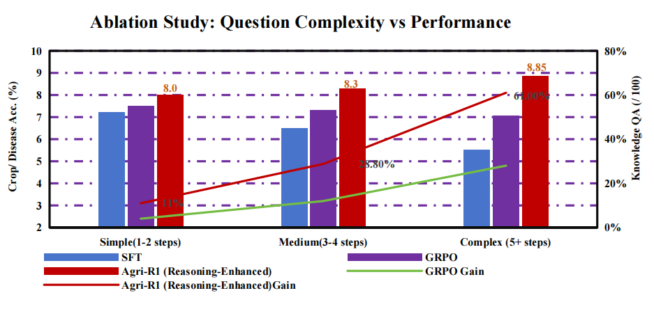
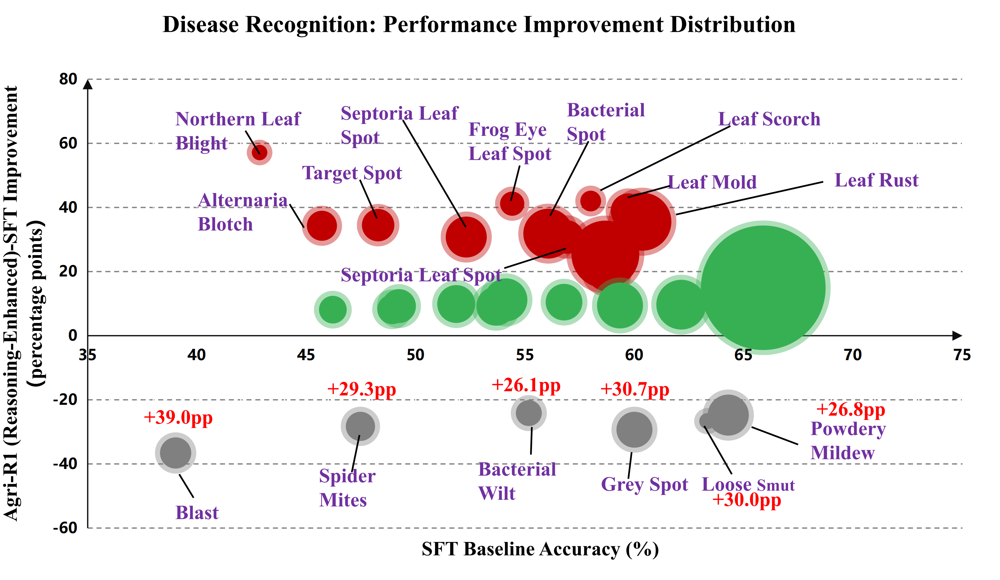
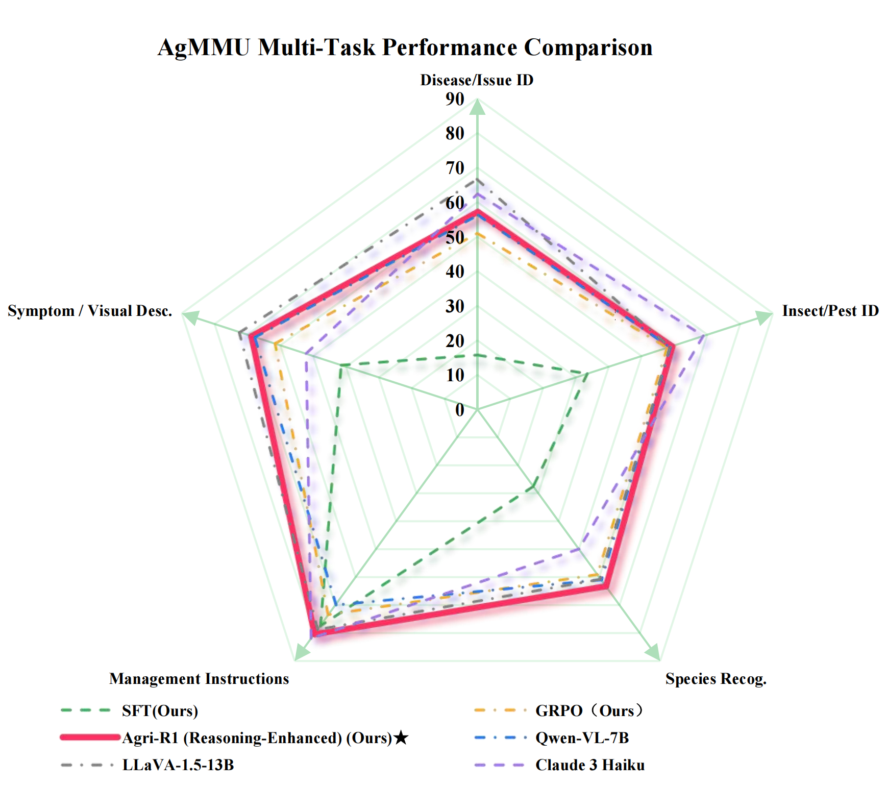
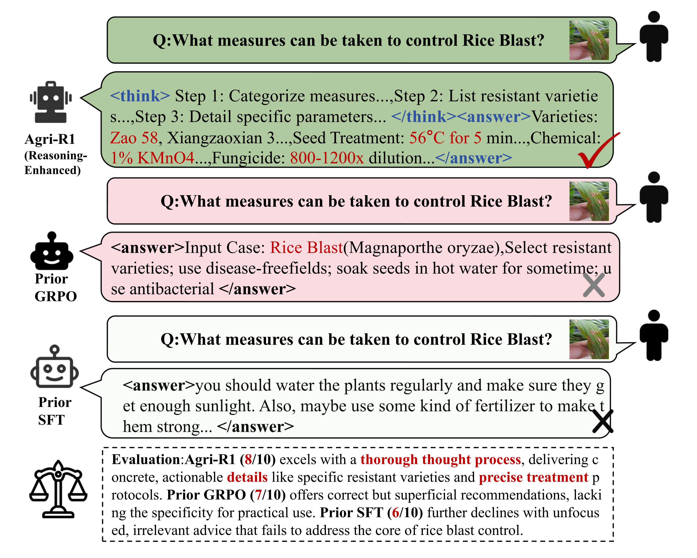

<div align="center">

# Agri-R1: Empowering Generalizable Agricultural Reasoning with Reinforcement Learning

**Reasoning-Enhanced Vision-Language Models for Agricultural Disease Diagnosis**

[](LICENSE)
[](https://www.python.org/)

[💾 Data Format](DATA_FORMAT.md) • [📝 Prompts & Evaluation](PROMPTS_AND_EVALUATION.md)

</div>

---

## Overview

Current agricultural vision-language models face three issues:
- **Data Hunger**: Need millions of labeled samples
- **Black-Box Predictions**: No reasoning or explanations
- **Poor Generalization**: Performance collapses on new crops/regions

We introduce **Agri-R1**, combining automated reasoning synthesis with Group Relative Policy Optimization (GRPO) to address these limitations. The framework achieves competitive performance using only 19% of training data while generating interpretable step-by-step diagnostic reasoning.

<div align="center">
  
  <p><i>Two-stage framework: (1) Automated Reasoning generation via VLM + LLM filtering, (2) GRPO training with domain-aware rewards</i></p>
</div>

---

## Key Results

<table align="center">
<tr>
<td width="50%">

### In-Distribution (CDDMBench)
| Task | SFT | Agri-R1 | Gain |
|------|-----|---------|------|
| Crop | 90.97% | **92.58%** | +1.6% |
| Disease | 58.84% | **72.50%** | +23.2% |
| Knowledge QA | 63.0 | **84.0** | +33.3% |

</td>
<td width="50%">

### Cross-Domain (AgMMU)
| Model | Params | Score |
|-------|--------|-------|
| SFT (ours) | 3B | 40.00% |
| **Agri-R1** | **3B** | **66.10%** |
| LLaVA-1.5 | 13B | 66.73% |
| LLaVA-NeXT | 8B | 66.71% |

</td>
</tr>
</table>

**Main takeaway**: Our 3B model trained on 19% data matches 7B-13B baselines on cross-domain tasks, with +26.10 points improvement over SFT.

---

## Why Reasoning Matters

We analyze how explicit reasoning scales with task complexity:

<div align="center">
  
</div>

- **Simple questions**: GRPO alone gives +4%, reasoning adds nothing
- **Medium complexity**: GRPO +12%, GRPO+Reasoning +28%
- **Complex multi-domain**: GRPO +28%, GRPO+Reasoning **+61%**

For knowledge-intensive agricultural diagnostics, explicit reasoning provides 2.2× amplification over exploration alone.

---

## Method

### Stage 1: Automated Reasoning Generation

```bash
cd src/stage1_reasoning

# Resize images
python resize_images_384.py --input_dir /path/to/images --output_dir ./images_384

# Sample 19% stratified data
python sample_dataset_20k.py --input_data full_dataset.json --output_data sampled.json

# Generate reasoning chains (DeepSeek-VL2)
python generate_reasoning.py --input_data sampled.json --output_dir ./reasoning_data

# Filter quality (GPT-4, threshold=8.0/10.0)
python enhance_reasoning.py --input_dir ./reasoning_data --output_dir ./reasoning_filtered --threshold 8.0
```

Output format:
```json
{
  "think": "Step 1: Identify plant morphology - leaf shape, venation pattern consistent with tomato. Step 2: Observe symptoms - circular brown lesions with concentric rings on leaf surface. Step 3: Assess distribution - spots on older leaves, typical of foliar fungal disease. Step 4: Diagnose - Alternaria solani based on target spot morphology; confidence high.",
  "answer": "Tomato Early Blight (Alternaria solani)"
}
```

### Stage 2: GRPO Training

```bash
# Train with reasoning (recommended)
bash src/scripts/train_grpo_with_reasoning.sh

# Baseline: SFT only
bash src/scripts/train_sft.sh
```

**Training config** (4×A800 80GB, 98 hours):
- Base model: Qwen2.5-VL-3B-Instruct
- Batch size: 160 (10/device × 4 accum × 4 GPUs)
- Learning rate: 8e-7 with cosine schedule
- GRPO: K=3 candidates, temperature=0.7
- DeepSpeed ZeRO-3 for memory balancing

**Reward function** (total range [0, 3.0]):
- Format (17%): Validates `<think>...</think><answer>...</answer>` structure
- Answer correctness (67%): Five-tier fuzzy matching on domain vocabularies (15 crops, 20 diseases)
- Reasoning quality (17%): Logical coherence, professional terminology, diagnostic chain completeness

---

## Analysis

### Frequency-Dependent Performance

<div align="center">
  
</div>

High-frequency crops (>5% of data) show stable improvements, but low-frequency crops exhibit extreme variance due to gradient competition. Cherry recognition drops 59% because Apple (29% frequency) receives 21× more gradient updates, overwriting shared representations.

### Cross-Domain Generalization

<div align="center">
  
</div>

SFT collapses from 91% (in-domain) to 40% (cross-domain) - a 51-point drop. GRPO maintains 66% on new scenarios because exploration learns domain-invariant features instead of dataset-specific patterns.

### Case Study: Reasoning Quality

<div align="center">
  
</div>

GRPO+Reasoning (8.0/10) provides actionable details like solution temperature (56°C), treatment duration (5 min), chemical concentration (1% KMnO₄). Standard GRPO (7.0/10) gives generic advice without operational parameters.

---

## Installation

```bash
git clone https://github.com/CPJ-Agricultural/Agri-R1.git
cd Agri-R1

# Setup environment
conda create -n agri-r1 python=3.11
conda activate agri-r1
pip install -r requirements.txt

# Install GRPO framework
cd src/r1-v && pip install -e . && cd ../..
```

**Requirements**:
- Training: 4×A800 80GB (or 4×A100), CUDA 11.8+, Flash Attention 2
- Inference: 1×A100 40GB minimum

---

## Evaluation

```bash
cd src/eval_vqa/cddmbench/crop_disease

# Inference
python inference_grpo_reasoning.py \
  --model_path /path/to/checkpoint-1800 \
  --input_json test_data.json \
  --output_json predictions.json

# Evaluate
python evaluate.py \
  --ground-truth-file test_data.json \
  --model-answers-file predictions.json
```

---

## Repository Structure

```
Agri-R1/
├── Images/                          # Paper figures
│   ├── pipeline.jpg
│   ├── figure2_disease_improvement.png
│   ├── figure3_agmmu_radar_improved.png
│   ├── figure4_complexity_comparison.png
│   └── figure5_cot-image.png
│
├── src/
│   ├── scripts/                     # Training scripts
│   │   ├── train_grpo_with_reasoning.sh  # Main training (GRPO + Reasoning)
│   │   ├── train_grpo_no_reasoning.sh    # Ablation (GRPO only)
│   │   └── train_sft.sh            # Baseline (SFT)
│   │
│   ├── stage1_reasoning/                 # Reasoning data generation
│   │   ├── resize_images_384.py
│   │   ├── sample_dataset_20k.py
│   │   ├── generate_reasoning.py
│   │   ├── enhance_reasoning.py
│   │   └── README.md
│   │
│   ├── r1-v/                       # GRPO training framework
│   │   ├── src/open_r1/
│   │   │   ├── grpo_vqa.py         # Reward function
│   │   │   └── trainer/grpo_trainer.py
│   │   └── configs/                # DeepSpeed configs
│   │
│   └── eval_vqa/                   # Evaluation suite
│       ├── cddmbench/              # In-distribution tests
│       └── agmmu/                  # Cross-domain tests
│
├── DATA_FORMAT.md                  # Dataset specifications
├── PROMPTS_AND_EVALUATION.md       # Prompt engineering & rewards
└── README.md
```

---

## Datasets

### CDDMBench (In-Distribution)
**Crop Disease Diagnosis Multimodal Benchmark** - Liu et al., ECCV 2024

- 1.05M training samples, 3,963 test samples
- 15 crop types, 20 disease categories
- Tasks: crop recognition, disease diagnosis, knowledge QA
- 🔗 [Dataset](https://github.com/UnicomAI/UnicomBenchmark/tree/main/CDDMBench)

### AgMMU (Cross-Domain)
**Agricultural Multimodal Understanding** - Gauba et al., 2025

- 770 multiple-choice questions across 5 agricultural tasks
- Global scenarios covering diverse regions and crops
- Measures generalization to unseen domains
- 🔗 [Dataset](https://agmmu.github.io/)

---

## Citation

```bibtex
@article{agri-r1-2025,
  title={Agri-R1: Empowering Generalizable Agricultural Reasoning in Vision-Language Models with Reinforcement Learning},
  author={[Authors]},
  year={2025}
}
```

---

## Acknowledgments

This work builds on:
- [R1-V](https://github.com/StarsfieldAI/R1-V) - GRPO framework for VLMs
- [Med-R1](https://github.com/Yuxiang-Lai117/Med-R1) - Medical reasoning with RL
- [Qwen2.5-VL](https://github.com/QwenLM/Qwen2-VL) - Base vision-language model
- [CDDMBench](https://github.com/UnicomAI/UnicomBenchmark/tree/main/CDDMBench) - Agricultural VQA benchmark
- [AgMMU](https://agmmu.github.io/) - Cross-domain evaluation

---

## License

Apache License 2.0 - See [LICENSE](LICENSE) for details.

---

<div align="center">

**ACL 2025 Submission**

*Achieving data efficiency, interpretability, and robust generalization through reasoning-enhanced reinforcement learning*

</div>
