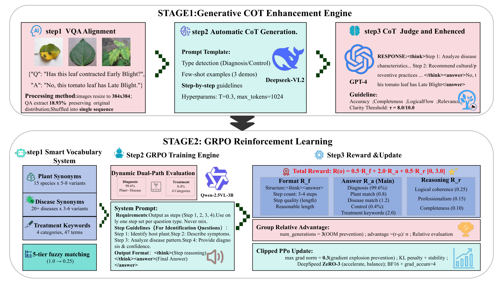

<div align="center">

# 🌾 Agri-R1: Reinforcement Learning for Agricultural Disease Diagnosis
### *Automated Chain-of-Thought via GRPO*

[](#)
[](#)
[](https://www.python.org/)
[](LICENSE)

**Data-Efficient** • **Interpretable** • **Cross-Domain Generalization** • **GRPO-Based**

[📊 Prompts & Evaluation](PROMPTS_AND_EVALUATION.md) • [📁 Data Format](DATA_FORMAT.md)

</div>

---

## 🏗️ Framework Architecture

<div align="center">
  
  <p><em>Figure 1: Two-stage GRPO framework with automated CoT generation</em></p>
</div>

---

## 🌟 Highlights

<table align="center">
<tr>
<td width="50%" valign="top">

### 🎯 **Key Innovation**

- **Automated CoT Generation**
  Self-distilled reasoning from VLMs without manual annotation

- **GRPO Reinforcement Learning**
  Robust policy optimization for agricultural VQA

- **Fuzzy-Matching Reward**
  Handles linguistic diversity in open-ended responses

</td>
<td width="50%" valign="top">

### ✨ **Performance**

- **Parameter Efficiency**
  3B model matches 7B-13B baselines

- **Data Efficiency**
  Train on only 18.93% of data (-81% reduction)

- **Strong Generalization**
  +26.10 points on cross-domain tasks

</td>
</tr>
</table>

---

## 💡 Overview

> **Agri-R1** addresses critical limitations in agricultural disease diagnosis:
> *How can we train accurate, interpretable models with limited data?*

### ❌ Limitations of Supervised Fine-Tuning

- **Data Hunger** - Requires millions of labeled samples
- **Black-Box Predictions** - No diagnostic reasoning provided
- **Poor Generalization** - Memorizes dataset-specific patterns

### ✅ Agri-R1 Solution

<table>
<tr>
<td width="5%">📝</td>
<td width="95%"><b>Stage 1: Automated CoT Generation</b><br/>DeepSeek-VL2 generates reasoning chains, GPT-4 filters quality (τ=8.0/10.0)</td>
</tr>
<tr>
<td>🎯</td>
<td><b>Stage 2: GRPO Training</b><br/>Group Relative Policy Optimization with fuzzy-matching rewards</td>
</tr>
<tr>
<td>🔍</td>
<td><b>Interpretable Output</b><br/>Structured <code>&lt;think&gt;</code> reasoning + <code>&lt;answer&gt;</code> format</td>
</tr>
</table>

---

## 📊 Performance Results

### 🎯 CDDMBench Benchmark (In-Distribution)

<table align="center">
<thead>
  <tr>
    <th>Task</th>
    <th>SFT (Full Data)</th>
    <th>GRPO+CoT (18.93% Data)</th>
    <th>Improvement</th>
  </tr>
</thead>
<tbody>
  <tr>
    <td><b>Crop Recognition</b></td>
    <td><code>90.97%</code></td>
    <td><code>92.58%</code> 🏆</td>
    <td><b style="color:green">+1.8%</b> 📈</td>
  </tr>
  <tr>
    <td><b>Disease Recognition</b></td>
    <td><code>58.84%</code></td>
    <td><code>72.50%</code> 🏆</td>
    <td><b style="color:green">+23.2%</b> 📈</td>
  </tr>
  <tr>
    <td><b>Knowledge QA</b></td>
    <td><code>63.0 / 100</code></td>
    <td><code>84.0 / 100</code> 🏆</td>
    <td><b style="color:green">+33.3%</b> 📈</td>
  </tr>
</tbody>
</table>

### 🔬 AgMMU Benchmark (Cross-Domain Generalization)

<table align="center">
<thead>
  <tr>
    <th>Model</th>
    <th>Parameters</th>
    <th>Harmonic Mean</th>
  </tr>
</thead>
<tbody>
  <tr>
    <td>SFT (Ours)</td>
    <td>3B</td>
    <td><code>40.00%</code></td>
  </tr>
  <tr>
    <td><b>GRPO+CoT (Ours)</b></td>
    <td><b>3B</b></td>
    <td><code><b>66.10%</b></code> 🏆</td>
  </tr>
  <tr>
    <td colspan="3" style="text-align:center"><i>Published Baselines (7B-13B)</i></td>
  </tr>
  <tr>
    <td>LLaVA-1.5</td>
    <td>13B</td>
    <td><code>66.73%</code></td>
  </tr>
  <tr>
    <td>LLaVA-NeXT</td>
    <td>8B</td>
    <td><code>66.71%</code></td>
  </tr>
  <tr>
    <td>Claude 3 Haiku</td>
    <td>—</td>
    <td><code>62.00%</code></td>
  </tr>
</tbody>
</table>

> 💡 **Our 3B model matches 7B-13B baselines while using only 18.93% training data**

---

## 📦 Dataset Information

### 🌱 CDDMBench (In-Distribution Evaluation)

**Crop Disease Diagnosis Multimodal Benchmark**

- 📄 **Paper**: Liu et al., "A multimodal benchmark dataset and model for crop disease diagnosis", ECCV 2024
- 🔗 **Dataset**: [https://github.com/UnicomAI/UnicomBenchmark/tree/main/CDDMBench](https://github.com/UnicomAI/UnicomBenchmark/tree/main/CDDMBench)
- 📊 **Scale**: 1.05M training samples, 3,963 test samples
- 🌱 **Coverage**: Covers crop recognition, disease diagnosis, knowledge QA and other dimensions
- 🎯 **Tasks**: Disease diagnosis, crop recognition, knowledge QA

### 🌍 AgMMU (Cross-Domain Generalization)

**Agricultural Multimodal Understanding Benchmark**

- 📄 **Paper**: Gauba et al., "AgMMU: A comprehensive agricultural multimodal understanding and reasoning benchmark"
- 🔗 **Dataset**: [https://agmmu.github.io/](https://agmmu.github.io/)
- 🌐 **Coverage**: Global agricultural scenarios across diverse regions
- 📊 **Test Set**: 770 multiple-choice questions across 5 tasks
- 🎯 **Purpose**: Cross-domain generalization evaluation

---

## 🚀 Quick Start

### 📥 Installation

```bash
# Clone the repository
git clone https://github.com/your-username/Agri-R1.git
cd Agri-R1

# Create conda environment
conda create -n agri-r1 python=3.11
conda activate agri-r1

# Install dependencies
pip install -r requirements.txt

# Install r1-v framework
cd src/r1-v
pip install -e .
cd ../..
```

### 💻 System Requirements

<table>
<tr>
<td width="50%" valign="top">

**Training**
- GPU: 4×A800 80GB
- CUDA: 11.8+ with Flash Attention 2
- Time: ~98 hours (97.7h)

</td>
<td width="50%" valign="top">

**Inference**
- GPU: 1×A100 40GB (minimum)
- Memory: 16GB+ RAM
- Storage: ~10GB for model weights

</td>
</tr>
</table>

---

## 🎓 Training Pipeline

### Stage 1: Automated CoT Data Generation

```bash
cd src/stage1_cot

# 1. Resize images to 384×384
python resize_images_384.py \
  --input_dir /path/to/images \
  --output_dir ./images_384

# 2. Sample 18.93% training data (stratified)
python sample_dataset_20k.py \
  --input_data /path/to/full_dataset.json \
  --output_data ./sampled_20k.json \
  --num_samples 200000

# 3. Generate CoT annotations via DeepSeek-VL2
python generate_cot.py \
  --input_data ./sampled_20k.json \
  --output_dir ./cot_data \
  --api_key YOUR_API_KEY \
  --model deepseek-vl2

# 4. Filter quality with GPT-4 (τ=8.0/10.0)
python enhance_cot.py \
  --input_dir ./cot_data \
  --output_dir ./cot_enhanced \
  --threshold 8.0
```

> 📖 **See [src/stage1_cot/README.md](src/stage1_cot/README.md) for detailed instructions**

### Stage 2: GRPO Reinforcement Learning

```bash
# Recommended: GRPO with CoT
bash src/scripts/train_grpo_with_cot.sh

# Alternative: GRPO without CoT (ablation study)
bash src/scripts/train_grpo_no_cot.sh

# Baseline: Supervised fine-tuning
bash src/scripts/train_sft.sh
```

#### Training Configuration

| Parameter | Value | Description |
|-----------|-------|-------------|
| **Base Model** | Qwen2.5-VL-3B-Instruct | Vision-language model |
| **Training Data** | 200,005 samples (18.93%) | Stratified sampling |
| **Hardware** | 4×A800 80GB | DeepSpeed ZeRO-3 |
| **Batch Size** | 160 | 10/device × 4 accum × 4 GPUs |
| **Learning Rate** | 8×10⁻⁷ | AdamW optimizer |
| **Epochs** | 3 (~3,750 steps) | Optimal: step 1,800 |
| **GRPO K** | 3 candidates | Temperature 0.7 |
| **Training Time** | ~98 hours (97.7h) | From scratch to best checkpoint |

---

## 🔍 Inference & Evaluation

### CDDMBench Evaluation

```bash
cd src/eval_vqa/cddmbench/crop_disease

# Run inference with CoT reasoning
python inference_grpo_cot.py \
  --model_path /path/to/checkpoint-1800 \
  --input_json test_data.json \
  --output_json predictions.json

# Evaluate results
python evaluate.py \
  --ground-truth-file test_data.json \
  --model-answers-file predictions.json \
  --output-file results.json
```

### AgMMU Evaluation

```bash
cd src/eval_vqa/agmmu

# Inference with CoT
python inference_base.py \
  --model_path /path/to/checkpoint-1800 \
  --data_path agmmu_validation.json \
  --output predictions.json

# Evaluate
python evaluate.py \
  --predictions predictions.json \
  --ground_truth agmmu_validation.json
```

### Python API Example

```python
from transformers import Qwen2_5_VLForConditionalGeneration, AutoProcessor
from PIL import Image
import torch

# Load model
model = Qwen2_5_VLForConditionalGeneration.from_pretrained(
    "path/to/checkpoint-1800",
    torch_dtype=torch.bfloat16,
    attn_implementation="flash_attention_2",
    device_map="auto"
)
processor = AutoProcessor.from_pretrained("path/to/checkpoint-1800")

# Prepare input
image = Image.open("tomato_disease.jpg")
messages = [{
    "role": "user",
    "content": [
        {"type": "image", "image": image},
        {"type": "text", "text": "What disease is this? Provide detailed reasoning."}
    ]
}]

# Generate prediction
text = processor.apply_chat_template(messages, tokenize=False, add_generation_prompt=True)
inputs = processor(text=[text], images=[image], return_tensors="pt").to("cuda")
outputs = model.generate(**inputs, max_new_tokens=512, do_sample=False)

response = processor.decode(outputs[0], skip_special_tokens=True)
print(response)

# Example output:
# <think>
# Step 1: Observe leaf characteristics - yellowing between veins with dark spots
# Step 2: Analyze spot patterns - circular lesions with concentric rings
# Step 3: Consider disease etiology - fungal pathogen Alternaria solani
# Step 4: Confirm diagnosis based on symptom morphology
# </think>
# <answer>Tomato Early Blight (Alternaria solani)</answer>
```

---

## 📁 Repository Structure

```
Agri-R1/
│
├── 🖼️ Images/                          # Pipeline visualizations
│   └── pipeline.png
│
├── 📊 datasets/                        # Training & evaluation data
│   ├── train and evaluation datasets/
│   └── evaluation datasets results/
│
├── 💻 src/
│   ├── scripts/                       # Training launch scripts
│   │   ├── train_grpo_with_cot.sh    # GRPO + CoT (recommended)
│   │   ├── train_grpo_no_cot.sh      # GRPO without CoT
│   │   └── train_sft.sh              # SFT baseline
│   │
│   ├── r1-v/                         # GRPO training framework
│   │   ├── src/open_r1/
│   │   │   ├── grpo_vqa.py           # GRPO trainer with CoT
│   │   │   └── trainer/
│   │   │       └── grpo_trainer.py   # Core GRPO implementation
│   │   └── configs/                  # DeepSpeed ZeRO-3 configs
│   │
│   ├── stage1_cot/                   # CoT data generation
│   │   ├── resize_images_384.py
│   │   ├── sample_dataset_20k.py
│   │   ├── generate_cot.py
│   │   ├── enhance_cot.py
│   │   └── README.md
│   │
│   └── eval_vqa/                     # Evaluation suite
│       ├── cddmbench/                # In-distribution
│       └── agmmu/                    # Cross-domain
│
├── 📄 PROMPTS_AND_EVALUATION.md      # Prompt engineering details
├── 📋 DATA_FORMAT.md                 # Data format specifications
├── 📦 requirements.txt               # Python dependencies
└── 📖 README.md                      # This file
```

---

## 🎯 Why Agri-R1 Works

### 1️⃣ GRPO Discovers Generalizable Patterns

<table>
<tr>
<th width="50%">❌ SFT (Memorization)</th>
<th width="50%">✅ GRPO (Exploration)</th>
</tr>
<tr>
<td valign="top">

**In-Distribution**: 90.97% crop acc
**Cross-Domain**: 40.00% (↓ 50.97 points)

*Problem: Severe performance collapse*

</td>
<td valign="top">

**In-Distribution**: 92.58% crop acc
**Cross-Domain**: 66.10% (+26.10 points vs SFT)

*Advantage: Robust domain transfer*

</td>
</tr>
</table>

### 2️⃣ Automated CoT Enables Interpretability

Different complexity levels benefit differently:

```diff
+ Simple Questions (1-2 steps):
  GRPO alone: +4% | GRPO+CoT: +4%
  → Exploration alone suffices

+ Medium Complexity (3-4 steps):
  GRPO alone: +12% | GRPO+CoT: +28%
  → CoT begins outpacing exploration

+ Complex Multi-Domain (5+ steps):
  GRPO alone: +28% | GRPO+CoT: +61%
  → CoT amplifies GRPO on knowledge-intensive tasks
```

### 3️⃣ Fuzzy-Matching Rewards Handle Diversity

Traditional binary rewards fail on open-ended agricultural VQA:

```json
{
  "ground_truth": "Tomato Early Blight",
  "prediction_1": "Early blight",          // 0.85 score (high-quality partial)
  "prediction_2": "Alternaria leaf spot",  // 1.0 score (synonym match)
  "prediction_3": "Fungal infection",      // 0.5 score (weak keyword)
  "prediction_4": "Rice blast",            // 0.0 score (no match)
}
```

5-tier fuzzy matching (1.0 → 0.85 → 0.7 → 0.5 → 0.25 → 0.0) handles linguistic diversity effectively.

---

## 🔬 Reproducibility

This repository provides complete transparency:

<table>
<tr>
<td width="50%" valign="top">

**🎯 Training**
- ✅ Complete training scripts
- ✅ Hyperparameter configurations
- ✅ DeepSpeed ZeRO-3 setup
- ✅ Checkpoint selection criteria

**📊 Evaluation**
- ✅ Benchmark evaluation scripts
- ✅ Metrics computation code
- ✅ Sample predictions included

</td>
<td width="50%" valign="top">

**🤖 CoT Generation**
- ✅ Generation prompts (DeepSeek-VL2)
- ✅ Quality filtering (GPT-4, τ=8.0)
- ✅ Data sampling strategy (18.93%)

**🏆 Reward Function**
- ✅ Format reward (0.5 weight)
- ✅ Answer reward (2.0 weight)
- ✅ Reasoning reward (0.5 weight)
- ✅ Fuzzy matching implementation

</td>
</tr>
</table>

---

## 🙏 Acknowledgements

This project builds upon excellent open-source work:

- **[R1-V](https://github.com/StarsfieldAI/R1-V)** - GRPO training framework for vision-language models
- **[Med-R1](https://github.com/Yuxiang-Lai117/Med-R1)** - Medical reasoning with reinforcement learning
- **[Qwen2.5-VL](https://github.com/QwenLM/Qwen2-VL)** - Powerful base vision-language model
- **[CDDMBench](https://github.com/UnicomAI/UnicomBenchmark/tree/main/CDDMBench)** - Agricultural VQA benchmark
- **[AgMMU](https://agmmu.github.io/)** - Cross-domain generalization benchmark

---

## 📜 License

This project is licensed under the **Apache License 2.0** - see [LICENSE](LICENSE) for details.

> **Note**: Code and models will be released upon ACL 2025 acceptance.

---

<div align="center">

### ⭐ **Anonymous ACL 2025 Submission** ⭐

*Data-efficient, interpretable agricultural AI through GRPO and automated CoT*
*Training on 18.93% data • 3B parameters • Matching 7B-13B baselines*

**[🔝 Back to Top](#-agri-r1-reinforcement-learning-for-agricultural-disease-diagnosis)**

</div>
