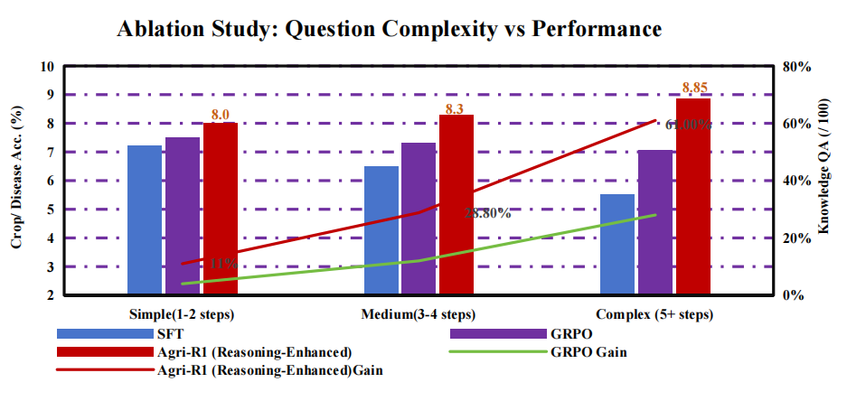
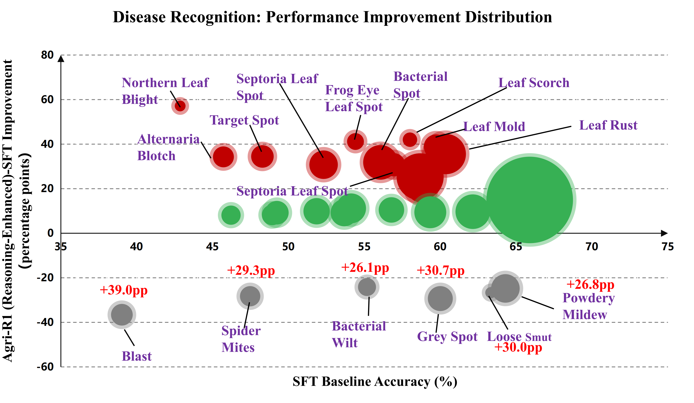
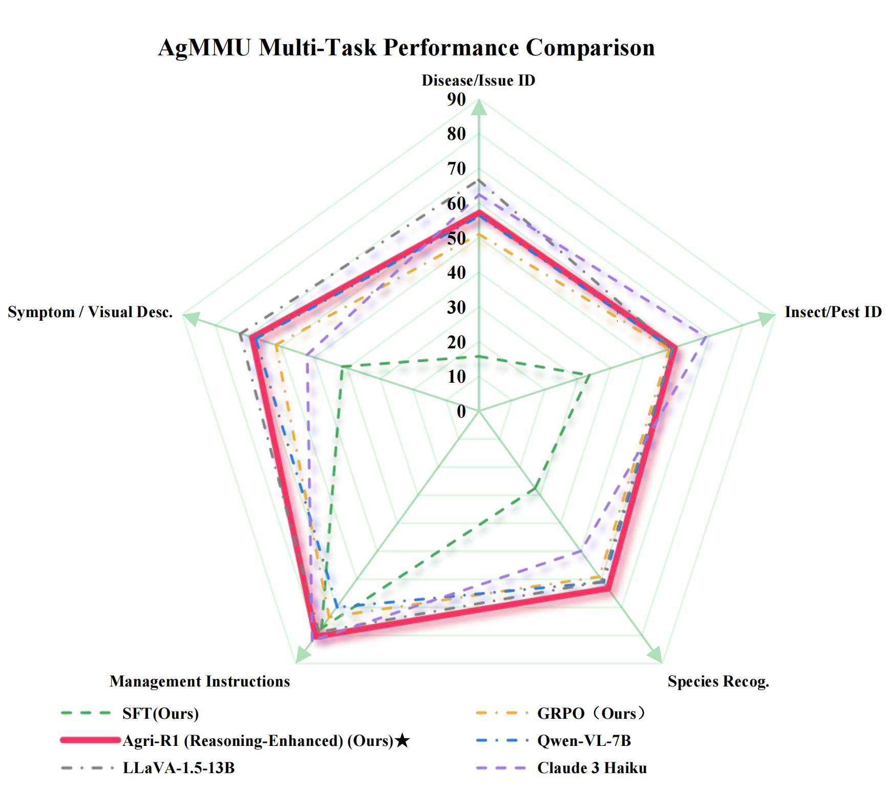
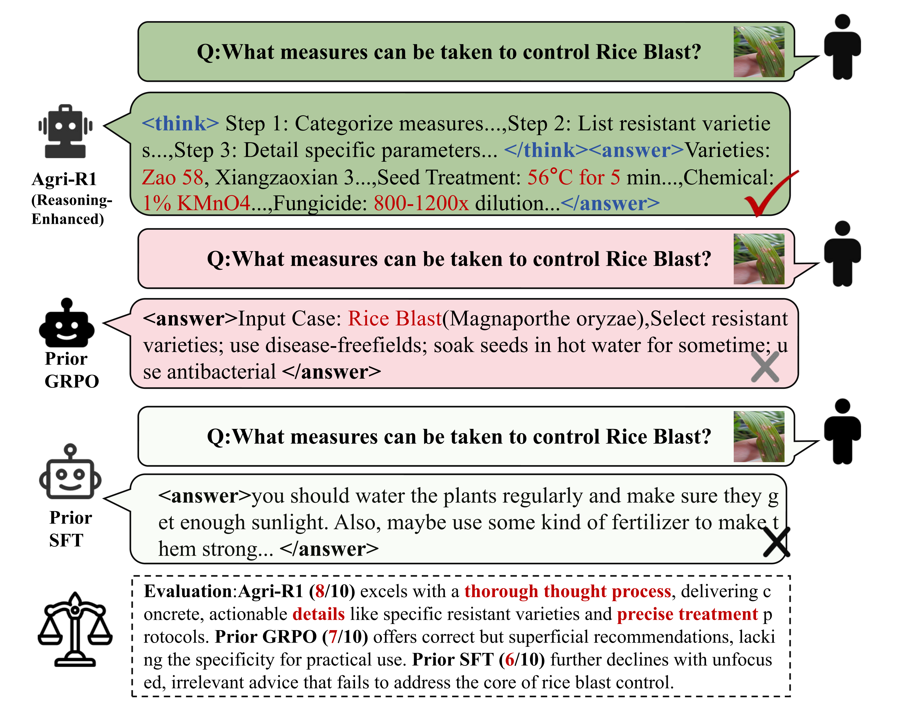

<div align="center">

# Agri-R1: Agricultural Reasoning for Disease Diagnosis via Automated-Synthesis and Reinforcement Learning

**Reasoning-Enhanced Vision-Language Models for Agricultural Disease Diagnosis**

[](LICENSE)
[](https://www.python.org/)

[💾 Data Format](DATA_FORMAT.md) • [📝 Prompts & Evaluation](PROMPTS_AND_EVALUATION.md)

</div>

---

## Overview

Current agricultural vision-language models face three critical limitations:
- **Data Hunger**: Require massive labeled datasets that are prohibitively expensive in resource-constrained agricultural settings
- **Limited Interpretability**: Produce diagnostic labels without explicating underlying reasoning ("black-box" behavior)
- **Poor Generalization**: Memorize dataset-specific patterns, leading to sharp performance drops under domain shifts

We introduce **Agri-R1**, to our knowledge the first GRPO-based framework specifically designed for open-ended, reasoning-enhanced agricultural VQA. Our framework automates high-quality reasoning data generation via vision-language synthesis and LLM-based filtering, using only 19% of available samples. Training employs Group Relative Policy Optimization (GRPO) with a novel domain-aware fuzzy-matching reward function.

<div align="center">
  
  <p><i>Two-stage framework: (1) Automated Reasoning generation via VLM + LLM-based filtering, (2) GRPO training with domain-aware rewards and five-tier fuzzy matching</i></p>
</div>

---

## Key Results

<table align="center">
<tr>
<td width="50%">

### In-Distribution (CDDMBench)
| Task | SFT | Agri-R1 | Gain |
|------|-----|---------|------|
| Crop | 90.97% | **92.58%** | +1.8% |
| Disease | 58.84% | **75.30%** | +27.9% |
| Knowledge QA | 63.0 | **84.0** | +33.3% |

</td>
<td width="50%">

### Cross-Domain (AgMMU)
| Model | Params | Score |
|-------|--------|-------|
| SFT (ours) | 3B | 40.00% |
| **Agri-R1** | **3B** | **66.10%** |
| LLaVA-1.5 | 13B | 66.73% |
| LLaVA-NeXT | 8B | 66.71% |

</td>
</tr>
</table>

**Main takeaway**: Our 3B model trained on 19% data matches 7B–13B baselines on cross-domain tasks, with +26.10 points improvement over SFT.

---

## Analysis Results

### Table 3: Generator–Judge Ablation

| Generator | Judge | Crop Acc. (%) | Disease Acc. (%) | KQA (/100) |
|-----------|-------|--------------|-----------------|------------|
| DeepSeek-VL2 | No Judge | 92.4 | 70.54 | 75.5 |
| DeepSeek-VL2 | DeepSeek Judge | 92.45 | 72.5 | 77.0 |
| DeepSeek-VL2 | Qwen72B Judge | 92.5 | 73.0 | 81.0 |
| **DeepSeek-VL2** | **GPT-4 Judge** | **92.58** | **75.3** | **84.0** |
| Qwen2.5-VL-72B | No Judge | 92.6 | 71.45 | 73.2 |
| Qwen2.5-VL-72B | DeepSeek Judge | 92.9 | 72.6 | 75.0 |
| Qwen2.5-VL-72B | Qwen72B Judge | 93.1 | 72.5 | 74.5 |
| Qwen2.5-VL-72B | GPT-4 Judge | **94.2** | 74.2 | 81.0 |

**Key finding**: External judge quality is paramount — GPT-4 judging consistently outperforms self-judging. DeepSeek-VL2 + GPT-4 gives the best overall balance and is used in main experiments.

### Table 4: Expert Evaluation of Reasoning Quality (N=200, scores 0–10)

| Method | Diag. Acc. | Reasoning Validity | Utility | Human–GPT-4 r |
|--------|-----------|-------------------|---------|---------------|
| SFT | 6.5 | 3.2 | 6.1 | 0.82 |
| GRPO | 7.6 | 5.6 | 7.3 | 0.86 |
| **Agri-R1 (Reasoning-Enhanced)** | **8.1** | **7.8** | **8.0** | **0.89** |

**Key finding**: The largest gain is in Reasoning Validity (+4.6 over SFT), confirming that explicit `<think>` supervision fundamentally improves diagnostic reasoning structure. Human–GPT-4 correlation ≥0.82 validates LLM-based scoring for both data filtering and reward design.

---

## Why Reasoning Matters

Explicit reasoning scales with task complexity:

<div align="center">
  
</div>

- **Simple questions**: GRPO alone gives +4%, reasoning adds little
- **Medium complexity**: GRPO +12%, GRPO+Reasoning +28%
- **Complex multi-domain**: GRPO +28%, GRPO+Reasoning **+61%**

For knowledge-intensive agricultural diagnostics, explicit reasoning provides 2.2× amplification over exploration alone.

---

## Method

### Stage 1: Automated Reasoning Generation (Generative Reasoning Enhancement Engine)

```bash
cd src/stage1_reasoning

# Resize images
python resize_images_384.py --input_dir /path/to/images --output_dir ./images_384

# Sample 19% stratified data
python sample_dataset_20k.py --input_data full_dataset.json --output_data sampled.json

# Generate reasoning chains (DeepSeek-VL2)
python generate_reasoning.py --input_data sampled.json --output_dir ./reasoning_data

# Filter quality (GPT-4, threshold=8.0/10.0)
python enhance_reasoning.py --input_dir ./reasoning_data --output_dir ./reasoning_filtered --threshold 8.0
```

Output format:
```json
{
  "think": "Step 1: Identify plant morphology - leaf shape, venation pattern consistent with tomato. Step 2: Observe symptoms - circular brown lesions with concentric rings on leaf surface. Step 3: Assess distribution - spots on older leaves, typical of foliar fungal disease. Step 4: Diagnose - Alternaria solani based on target spot morphology; confidence high.",
  "answer": "Tomato Early Blight (Alternaria solani)"
}
```

**Quality Rubric** (threshold τ=8.0/10.0):
| Criterion | Score | Focus |
|-----------|-------|-------|
| Accuracy | 0–2 | Correct plant/disease ID; no hallucination |
| Completeness | 0–2 | Key elements: plant, symptoms, disease |
| Detail | 0–2 | Measurements, colors, distribution |
| Relevance | 0–2 | Diagnosis-relevant; no redundancy |
| Clarity | 0–2 | Professional terms; logical flow |

### Stage 2: GRPO Training

```bash
# Train with reasoning (recommended)
bash src/scripts/train_grpo_with_reasoning.sh

# Baseline: SFT only
bash src/scripts/train_sft.sh
```

**Training config** (4×A800 80GB, 98 hours):
- Base model: Qwen2.5-VL-3B-Instruct
- Batch size: 160 (10/device × 4 accum × 4 GPUs)
- Learning rate: 8e-7 with cosine schedule
- GRPO: K=3 candidates, temperature=0.7
- DeepSpeed ZeRO-3, BF16 mixed precision

**Reward function** (total range [0, 3.0]):
- Format (17%, w=0.5): Validates `<think>...</think><answer>...</answer>` structure
- Answer correctness (67%, w=2.0): Five-tier fuzzy matching on domain vocabularies (crops + diseases)
- Reasoning quality (17%, w=0.5): Logical coherence, professional terminology, diagnostic chain completeness

**Five-tier fuzzy matching**:
| Tier | Score | Criteria |
|------|-------|----------|
| 1 | 1.00 | Exact synonym match from vocabulary |
| 2 | 0.85 | High-quality: multi-word term, missing 1 word |
| 3 | 0.70 | Partial: keyword stem matching (first 6 chars) |
| 4 | 0.50 | Keyword: core word present (length >3) |
| 5 | 0.25 | Weak: related terms (e.g., blight↔disease) |

---

## Analysis

### Frequency-Dependent Performance

<div align="center">
  
</div>

High-frequency crops (>5%) show stable improvements (σ=3.2 pp), but low-frequency crops (<2%) exhibit high variance (σ=22.1 pp) due to gradient competition. Cherry recognition drops 59% because Apple (29% frequency) receives 21× more gradient updates. A frequency-aware (FA) reward variant recovers all low-frequency crops to above their SFT baselines.

### Cross-Domain Generalization

<div align="center">
  
</div>

SFT collapses from 90.97% (in-domain) to 40.00% (cross-domain) — a 50.97-point drop. GRPO maintains 59.75% on new scenarios, and Agri-R1 further boosts generalization to 66.10% (+26.10 points over SFT).

### Case Study: Reasoning Quality

<div align="center">
  
</div>

Agri-R1 (8/10) provides actionable details like variety names (Zao 58, Xiangzaoxian 3), treatment conditions (56°C for 5 min), and fungicide dilution ratios (800–1200×). Standard GRPO (7/10) identifies correct strategies but lacks operational specificity. SFT (6/10) gives broad, unfocused advice.

---

## Installation

```bash
git clone https://github.com/CPJ-Agricultural/Agri-R1.git
cd Agri-R1

# Setup environment
conda create -n agri-r1 python=3.11
conda activate agri-r1
pip install -r requirements.txt

# Install GRPO framework
cd src/r1-v && pip install -e . && cd ../..
```

**Requirements**:
- Training: 4×A800 80GB (or 4×A100), CUDA 11.8+, Flash Attention 2
- Inference: 1×A100 40GB minimum

---

## Evaluation

```bash
cd src/eval_vqa/cddmbench/crop_disease

# Inference
python inference_grpo_reasoning.py \
  --model_path /path/to/checkpoint-1800 \
  --input_json test_data.json \
  --output_json predictions.json

# Evaluate
python evaluate.py \
  --ground-truth-file test_data.json \
  --model-answers-file predictions.json
```

---

## Repository Structure

```
Agri-R1/
├── Images/                          # Paper figures
│   ├── figure1_construct image.jpg  # Framework overview
│   ├── figure2_disease_improvement.png
│   ├── figure3_agmmu_radar_improved.png
│   ├── figure4_complexity_comparison.png
│   └── figure5_cot-image.png
│
├── src/
│   ├── scripts/                     # Training scripts
│   │   ├── train_grpo_with_reasoning.sh  # Main training (GRPO + Reasoning)
│   │   ├── train_grpo_no_reasoning.sh    # Ablation (GRPO only)
│   │   └── train_sft.sh            # Baseline (SFT)
│   │
│   ├── stage1_reasoning/            # Reasoning data generation
│   │   ├── resize_images_384.py
│   │   ├── sample_dataset_20k.py
│   │   ├── generate_reasoning.py
│   │   ├── enhance_reasoning.py
│   │   └── README.md
│   │
│   ├── r1-v/                        # GRPO training framework
│   │   ├── src/open_r1/
│   │   │   ├── grpo_vqa.py          # Standard reward function
│   │   │   ├── grpo_vqa -FA weighting.py  # Frequency-aware reward variant
│   │   │   └── trainer/grpo_trainer.py
│   │   └── configs/                 # DeepSpeed configs
│   │
│   └── eval_vqa/                    # Evaluation suite
│       ├── cddmbench/               # In-distribution tests
│       └── agmmu/                   # Cross-domain tests
│
├── DATA_FORMAT.md                   # Dataset specifications
├── PROMPTS_AND_EVALUATION.md        # Prompt engineering & rewards
└── README.md
```

---

## Datasets

### CDDMBench (In-Distribution)
**Crop Disease Diagnosis Multimodal Benchmark** — Liu et al., ECCV 2024

- ~1.05M training samples, 3,963 test samples
- 16 crop species, 60 disease categories
- Tasks: crop recognition, disease diagnosis, knowledge QA
- 🔗 [Dataset](https://github.com/UnicomAI/UnicomBenchmark/tree/main/CDDMBench)

### AgMMU (Cross-Domain)
**Agricultural Multimodal Understanding** — Gauba et al., 2025

- 770 multiple-choice questions across 5 agricultural tasks
- Global scenarios covering diverse regions and crops
- Measures generalization to unseen domains
- 🔗 [Dataset](https://agmmu.github.io/)

---

## Citation

```bibtex
@misc{zhang2026agrir1agriculturalreasoningdisease,
      title={Agri-R1: Agricultural Reasoning for Disease Diagnosis via Automated-Synthesis and Reinforcement Learning}, 
      author={Wentao Zhang and Mingkun Xu and Qi Zhang and Shangyang Li and Derek F. Wong and Lifei Wang and Yanchao Yang and Lina Lu and Tao Fang},
      year={2026},
      eprint={2601.04672},
      archivePrefix={arXiv},
      primaryClass={cs.CV},
      url={https://arxiv.org/abs/2601.04672}, 
}
```

---

## Acknowledgments

This work builds on:
- [R1-V](https://github.com/StarsfieldAI/R1-V) — GRPO framework for VLMs
- [Med-R1](https://github.com/Yuxiang-Lai117/Med-R1) — Medical reasoning with RL
- [Qwen2.5-VL](https://github.com/QwenLM/Qwen2-VL) — Base vision-language model
- [CDDMBench](https://github.com/UnicomAI/UnicomBenchmark/tree/main/CDDMBench) — Agricultural VQA benchmark
- [AgMMU](https://agmmu.github.io/) — Cross-domain evaluation

---

## License

Apache License 2.0 — See [LICENSE](LICENSE) for details.

---

<div align="center">

**ACM MM 2026 Submission**

*Achieving data efficiency, interpretability, and robust generalization through reasoning-enhanced reinforcement learning*

</div>
